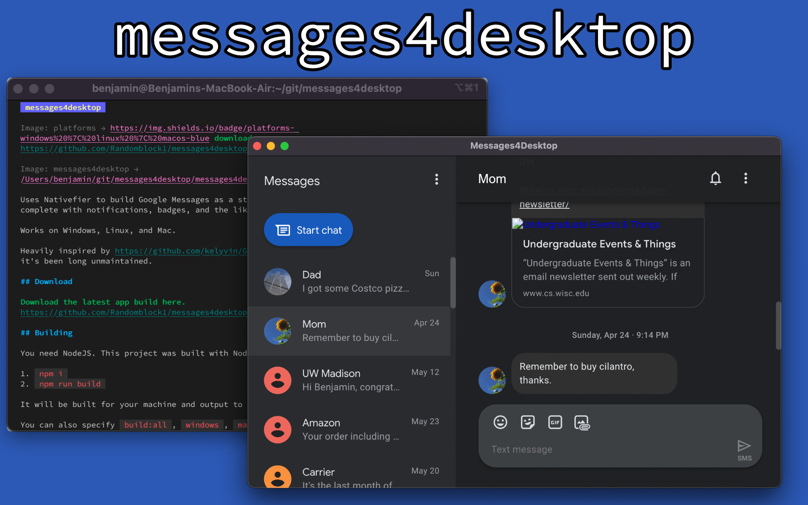

# messages4desktop

Uses Nativefier to build Google Messages as a standalone desktop app, complete with notifications, badges, and the like.

Works on Windows, Linux, and Mac.

Heavily inspired by <https://github.com/kelyvin/Google-Messages-For-Desktop>, but it's been long unmaintained.

## Download

[Download the latest app build here.](https://github.com/Randomblock1/messages4desktop/releases)

## Building

You need NodeJS. This project was built with NodeJS 16.

1. `npm i`
2. `npm run build`

It will be built for your machine and output to the `dist` directory.

You can also specify `build:all`, `windows`, `mac`, or `linux` in place of `build` to target a specific platform.

In addition, GitHub Actions creates a weekly build of the app, to ensure that everything is up to date.
